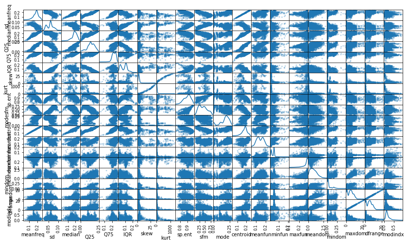
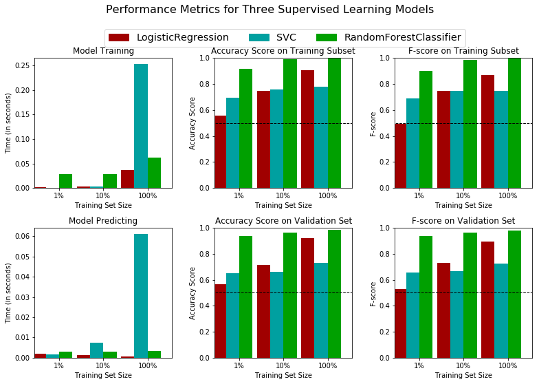
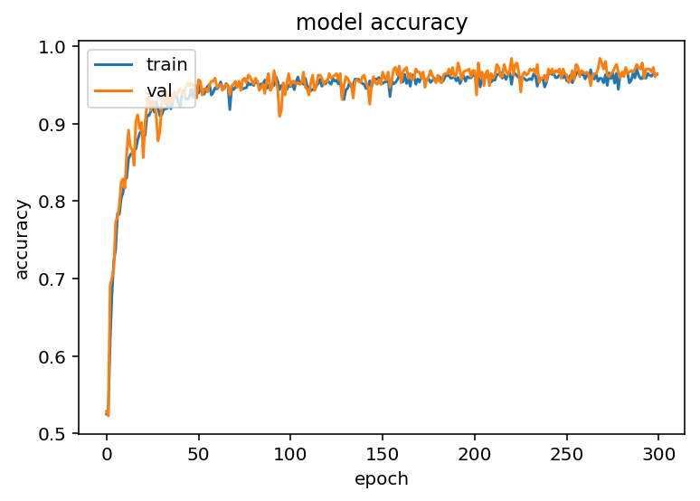
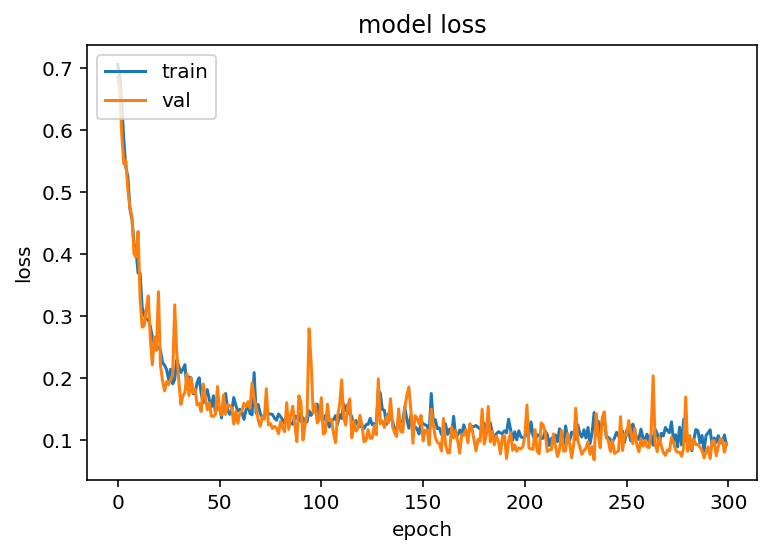
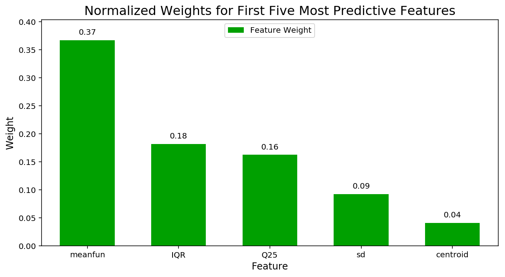

# 机器学习纳米学位
## 毕业设计

----
## 一、项目概述

### 1.1 声音性别识别

数据集来源于kaggle上的一个数据竞赛，这个数据集包含3168个样本，其中50%为男性，50%为女性。数据是已经经过处理的声音信息，包括声音的各种信息的统计量。

### 1.2 问题说明

使用机器学习的方法判断一段音频信号是男性还是女性。

----
## 二、 输入数据

### 2.1 声音特征预览


```python
# 检查你的Python版本
from sys import version_info
if version_info.major != 2 and version_info.minor != 7:
    raise Exception('请使用Python 2.7来完成此项目')
```


```python
# 为这个项目导入需要的库
import numpy as np
import pandas as pd
from time import time
from IPython.display import display # 允许为DataFrame使用display()

# 导入附加的可视化代码visuals.py
import visuals as vs

# 为notebook提供更加漂亮的可视化
%matplotlib inline

# 导入人口普查数据
data = pd.read_csv("voice.csv")

# 成功 - 显示第一条记录
display(data.head(n=1))
```


<div>
<style scoped>
    .dataframe tbody tr th:only-of-type {
        vertical-align: middle;
    }

    .dataframe tbody tr th {
        vertical-align: top;
    }

    .dataframe thead th {
        text-align: right;
    }
</style>
<table border="1" class="dataframe">
  <thead>
    <tr style="text-align: right;">
      <th></th>
      <th>meanfreq</th>
      <th>sd</th>
      <th>median</th>
      <th>Q25</th>
      <th>Q75</th>
      <th>IQR</th>
      <th>skew</th>
      <th>kurt</th>
      <th>sp.ent</th>
      <th>sfm</th>
      <th>...</th>
      <th>centroid</th>
      <th>meanfun</th>
      <th>minfun</th>
      <th>maxfun</th>
      <th>meandom</th>
      <th>mindom</th>
      <th>maxdom</th>
      <th>dfrange</th>
      <th>modindx</th>
      <th>label</th>
    </tr>
  </thead>
  <tbody>
    <tr>
      <th>0</th>
      <td>0.059781</td>
      <td>0.064241</td>
      <td>0.032027</td>
      <td>0.015071</td>
      <td>0.090193</td>
      <td>0.075122</td>
      <td>12.863462</td>
      <td>274.402906</td>
      <td>0.893369</td>
      <td>0.491918</td>
      <td>...</td>
      <td>0.059781</td>
      <td>0.084279</td>
      <td>0.015702</td>
      <td>0.275862</td>
      <td>0.007812</td>
      <td>0.007812</td>
      <td>0.007812</td>
      <td>0.0</td>
      <td>0.0</td>
      <td>male</td>
    </tr>
  </tbody>
</table>
<p>1 rows × 21 columns</p>
</div>


总共包涵21个声音特征。

### 2.2、数量总览
对数据集进行一个粗略的探索，看看有多少声音来自于男生，多少声音来自于女声。


```python
# TODO：总的记录数
n_records = data.shape[0]

# TODO：被调查者的收入大于$50,000的人数
male_amount = data[data.label == 'male'].shape[0]

# TODO：被调查者的收入最多为$50,000的人数
female_amount = data[data.label == 'female'].shape[0]

# TODO：被调查者收入大于$50,000所占的比例
male_percent =100* float(male_amount)/n_records

# 打印结果
print "Total number of records: {}".format(n_records)
print "male amount: {}".format(male_amount)
print "female amount0: {}".format(female_amount)
print "Percentage of male: {:.2f}%".format(male_percent)
```

    Total number of records: 3168
    male amount: 1584
    female amount0: 1584
    Percentage of male: 50.00%


### 获得特征和标签
`label` 列作为标签列单独存放。


```python
# 将数据切分成特征和对应的标签
label_raw = data['label']
features_raw = data.drop('label', axis = 1)
```

### 2.3、探索数据分布


```python
# 对于数据中的每一对特征构造一个散布矩阵
pd.plotting.scatter_matrix(features_raw, alpha = 0.3, figsize = (14,8), diagonal = 'kde');
```





----
## 三、准备数据


### 3.1 数据预处理
 - 将目标标签`'label'`转换成数字项。
   - 将"male"转换成`1`；将"female"转换成`0`。


```python
# TODO：将'lable_raw'编码成数字值
label = label_raw.replace({"male":1, "female":0})
features = features_raw
```

### 3.2 混洗和切分数据
现在所有的 _类别变量_ 已被转换成数值特征，而且所有的数值特征已被规一化。和我们一般情况下做的一样，现在将数据（包括特征和它们的标签）切分成训练和测试集。其中80%的数据将用于训练和20%的数据用于测试。然后再进一步把训练数据分为训练集和验证集，用来选择和优化模型。


```python
# 导入 train_test_split
from sklearn.model_selection import train_test_split

# 将'features'和'income'数据切分成训练集和测试集
X_train, X_test, y_train, y_test = train_test_split(features, label, test_size = 0.2, random_state = 0,
                                                    stratify = label)
# 将'X_train'和'y_train'进一步切分为训练集和验证集
X_train, X_val, y_train, y_val = train_test_split(X_train, y_train, test_size=0.2, random_state=0,
                                                    stratify = y_train)

# 显示切分的结果
print "Training set has {} samples.".format(X_train.shape[0])
print "Validation set has {} samples.".format(X_val.shape[0])
print "Testing set has {} samples.".format(X_test.shape[0])
```

    Training set has 2027 samples.
    Validation set has 507 samples.
    Testing set has 634 samples.


----
## 四、训练模型
在这一部分中，本文将尝试四种不同的算法，并确定哪一个能够最好地建模数据。
- 随机森林 (Random Forest)
- 支撑向量机 (SVM)
- Logistic回归（LogisticRegression）
- 深度神经网络（DNN）

### 4.1 创建一个训练和预测的流水线
在下面的代码单元实现以下功能：

 - 从[`sklearn.metrics`](http://scikit-learn.org/stable/modules/classes.html#sklearn-metrics-metrics)中导入`fbeta_score`和`accuracy_score`。
 - 用训练集拟合学习器，并记录训练时间。
 - 对训练集的前300个数据点和验证集进行预测并记录预测时间。
 - 计算预测训练集的前300个数据点的准确率和F-score。
 - 计算预测验证集的准确率和F-score。


```python
# TODO：从sklearn中导入两个评价指标 - fbeta_score和accuracy_score
from sklearn.metrics import fbeta_score, accuracy_score


def train_predict(learner, sample_size, X_train, y_train, X_val, y_val): 
    '''
    inputs:
       - learner: the learning algorithm to be trained and predicted on
       - sample_size: the size of samples (number) to be drawn from training set
       - X_train: features training set
       - y_train: income training set
       - X_val: features validation set
       - y_val: income validation set
    '''
    
    results = {}
    
    # TODO：使用sample_size大小的训练数据来拟合学习器
    # TODO: Fit the learner to the training data using slicing with 'sample_size'
    start = time() # 获得程序开始时间
    
    learner.fit(X_train[0: sample_size], y_train[0: sample_size])
    end = time() # 获得程序结束时间
    
    # TODO：计算训练时间
    results['train_time'] = end - start
    
    # TODO: 得到在验证集上的预测值
    #       然后得到对前300个训练数据的预测结果
    start = time() # 获得程序开始时间
    predictions_val = learner.predict(X_val)
    predictions_train = learner.predict(X_train[0:300])
    end = time() # 获得程序结束时间
    
    # TODO：计算预测用时
    results['pred_time'] = end - start
            
    # TODO：计算在最前面的300个训练数据的准确率
    results['acc_train'] = accuracy_score(y_train[0:300], predictions_train)
        
    # TODO：计算在验证上的准确率
    results['acc_val'] = accuracy_score(y_val, predictions_val)
    
    # TODO：计算在最前面300个训练数据上的F-score
    results['f_train'] = fbeta_score(y_train[0:300], predictions_train, beta=0.5)
        
    # TODO：计算验证集上的F-score
    results['f_val'] = fbeta_score(y_val, predictions_val,beta=0.5)
       
    # 成功
    print "{} trained on {} samples.".format(learner.__class__.__name__, sample_size)
        
    # 返回结果
    return results
```

### 4.2 三个机器学习训练以及模型的评估
在下面的代码单元中，实现以下功能：             
- 导入了在前面讨论的三个监督学习模型。             
- 初始化了三个模型并存储在`'clf_A'`，`'clf_B'`和`'clf_C'`中。
  - 使用模型的默认参数值，在接下来的部分中你将需要对某一个模型的参数进行调整。             
  - 设置`random_state` （方便方便调试）。       
- 计算1%， 10%， 100%的训练数据分别对应多少个数据点，并将这些值存储在`'samples_1'`, `'samples_10'`, `'samples_100'`中


```python
# TODO：从sklearn中导入三个监督学习模型
from sklearn.ensemble import RandomForestClassifier
from sklearn.svm import SVC
from sklearn.linear_model import LogisticRegression
# TODO：初始化三个模型
clf_A = RandomForestClassifier(n_estimators=10,random_state=10)
clf_B = SVC(random_state=8)
clf_C = LogisticRegression(random_state=10)

# TODO：计算1%， 10%， 100%的训练数据分别对应多少点
n_train_records = y_train.shape[0]
samples_1 = int(0.01 * n_train_records)
samples_10 = int(0.1 * n_train_records)
samples_100 = int( 1 * n_train_records)

# 收集学习器的结果
results = {}
for clf in [clf_A, clf_B, clf_C]:
    clf_name = clf.__class__.__name__
    results[clf_name] = {}
    for i, samples in enumerate([samples_1, samples_10, samples_100]):
        results[clf_name][i] = train_predict(clf, samples, X_train, y_train, X_val, y_val)

# 对选择的三个模型得到的评价结果进行可视化
vs.evaluate(results, 0.5, 0.5)
```

    RandomForestClassifier trained on 20 samples.
    RandomForestClassifier trained on 202 samples.
    RandomForestClassifier trained on 2027 samples.
    SVC trained on 20 samples.
    SVC trained on 202 samples.
    SVC trained on 2027 samples.
    LogisticRegression trained on 20 samples.
    LogisticRegression trained on 202 samples.
    LogisticRegression trained on 2027 samples.





----
## 4.3 提高效果

选择表现最好的随机森林模型来提高效果。使用网格搜索来至少调整模型的重要参数。接下来的代码单元中实现以下功能：

- 导入`sklearn.model_selection.GridSearchCV` 和 `sklearn.metrics.make_scorer`.
- 初始化选择的分类器，并将其存储在`clf`中。
 - 设置`random_state`。
- 创建一个对于这个模型你希望调整参数的字典。
 - 例如: parameters = {'parameter' : [list of values]}。
- 使用`make_scorer`来创建一个`fbeta_score`评分对象（设置$\beta = 0.5$）。
- 在分类器clf上用'scorer'作为评价函数运行网格搜索，并将结果存储在grid_obj中。
- 用训练集（X_train, y_train）训练grid search object,并将结果存储在`grid_fit`中。


```python
# TODO：导入'GridSearchCV', 'make_scorer'和其他一些需要的库
# import sklearn.model_selection.GridSearchCV, KFold

# import sklearn.metrics.make_scorer
from sklearn.model_selection import GridSearchCV, KFold
from sklearn.metrics import make_scorer
from sklearn.ensemble import RandomForestClassifier

from sklearn.metrics import make_scorer, fbeta_score, accuracy_score

# TODO：初始化分类器
clf = RandomForestClassifier(random_state=10)

# TODO：创建你希望调节的参数列表
parameters = {'n_estimators': range(5, 40)}

# TODO：创建一个fbeta_score打分对象
scorer  = make_scorer(fbeta_score, beta=0.5)

# TODO：在分类器上使用网格搜索，使用'scorer'作为评价函数

kfold = KFold(n_splits=10)
grid_obj = GridSearchCV(clf, parameters, scorer, cv=kfold)

# TODO：用训练数据拟合网格搜索对象并找到最佳参数
grid_obj.fit(X_train, y_train)
# 得到estimator
best_clf = grid_obj.best_estimator_

# 使用没有调优的模型做预测
predictions = clf_A.predict(X_val)
best_predictions = best_clf.predict(X_val)


# 汇报调参前和调参后的分数
print "Unoptimized model\n------"
print "Accuracy score on validation data: {:.4f}".format(accuracy_score(y_val, predictions))
print "F-score on validation data: {:.4f}".format(fbeta_score(y_val, predictions, beta = 0.5))
print "\nOptimized Model\n------"
print "Final accuracy score on the validation data: {:.4f}".format(accuracy_score(y_val, best_predictions))
print "Final F-score on the validation data: {:.4f}".format(fbeta_score(y_val, best_predictions, beta = 0.5))
```

    Unoptimized model
    ------
    Accuracy score on validation data: 0.9822
    F-score on validation data: 0.9811
    
    Optimized Model
    ------
    Final accuracy score on the validation data: 0.9822
    Final F-score on the validation data: 0.9811


### 4.4 使用DNN识别


```python
from keras.layers import *
from keras.models import *

import numpy as np
import os
from keras.optimizers import *

print X_train.shape
input_shape=(X_train.shape[1],)
act = 'relu'

input_layer = Input(shape=input_shape, name='the_input')
inner = Dense(128, kernel_initializer='random_normal', name='dense1')(input_layer)
inner = Activation(act)(inner)
inner = Dropout(0.2)(inner)
inner = Dense(256, kernel_initializer='random_normal', name='dense2')(inner)
inner = Activation(act)(inner)
inner = Dropout(0.2)(inner)
inner = Dense(256, kernel_initializer='random_normal', name='dense3')(inner)
inner = Activation(act)(inner)
inner = Dropout(0.2)(inner)
inner = Dense(128, kernel_initializer='random_normal', name='dense4')(inner)
inner = Activation(act)(inner)
inner = Dropout(0.2)(inner)
inner = Dense(128, kernel_initializer='random_normal', name='dense5')(inner)
inner = Activation(act)(inner)
inner = Dropout(0.2)(inner)
inner = Dense(1, kernel_initializer='random_normal', name='dense-final')(inner)
y_pred = Activation('sigmoid', name='sigmoid')(inner)

model = Model(inputs=input_layer, outputs=y_pred)
model.summary()

model.compile(loss='binary_crossentropy',
              optimizer="adam",
              metrics=['accuracy'])
```

    (2027, 20)
    _________________________________________________________________
    Layer (type)                 Output Shape              Param #   
    =================================================================
    the_input (InputLayer)       (None, 20)                0         
    _________________________________________________________________
    dense1 (Dense)               (None, 128)               2688      
    _________________________________________________________________
    activation_21 (Activation)   (None, 128)               0         
    _________________________________________________________________
    dropout_19 (Dropout)         (None, 128)               0         
    _________________________________________________________________
    dense2 (Dense)               (None, 256)               33024     
    _________________________________________________________________
    activation_22 (Activation)   (None, 256)               0         
    _________________________________________________________________
    dropout_20 (Dropout)         (None, 256)               0         
    _________________________________________________________________
    dense3 (Dense)               (None, 256)               65792     
    _________________________________________________________________
    activation_23 (Activation)   (None, 256)               0         
    _________________________________________________________________
    dropout_21 (Dropout)         (None, 256)               0         
    _________________________________________________________________
    dense4 (Dense)               (None, 128)               32896     
    _________________________________________________________________
    activation_24 (Activation)   (None, 128)               0         
    _________________________________________________________________
    dropout_22 (Dropout)         (None, 128)               0         
    _________________________________________________________________
    dense5 (Dense)               (None, 128)               16512     
    _________________________________________________________________
    activation_25 (Activation)   (None, 128)               0         
    _________________________________________________________________
    dropout_23 (Dropout)         (None, 128)               0         
    _________________________________________________________________
    dense-final (Dense)          (None, 1)                 129       
    _________________________________________________________________
    sigmoid (Activation)         (None, 1)                 0         
    =================================================================
    Total params: 151,041
    Trainable params: 151,041
    Non-trainable params: 0
    _________________________________________________________________


### 开始训练模型


```python
history = model.fit(X_train, y_train, epochs=300, validation_data=(X_val, y_val))
```

    Train on 2027 samples, validate on 507 samples
    Epoch 1/300
    2027/2027 [==============================] - 1s 469us/step - loss: 0.7054 - acc: 0.5249 - val_loss: 0.6843 - val_acc: 0.5286
    Epoch 2/300
    2027/2027 [==============================] - 0s 151us/step - loss: 0.6880 - acc: 0.5289 - val_loss: 0.6639 - val_acc: 0.5227
    Epoch 3/300
    2027/2027 [==============================] - 0s 153us/step - loss: 0.6393 - acc: 0.6182 - val_loss: 0.5921 - val_acc: 0.6903
    Epoch 4/300
    2027/2027 [==============================] - 0s 155us/step - loss: 0.5840 - acc: 0.6803 - val_loss: 0.5450 - val_acc: 0.7002
    Epoch 5/300
    2027/2027 [==============================] - 0s 152us/step - loss: 0.5389 - acc: 0.7222 - val_loss: 0.5509 - val_acc: 0.7140
    Epoch 6/300
    2027/2027 [==============================] - 0s 149us/step - loss: 0.5247 - acc: 0.7380 - val_loss: 0.5024 - val_acc: 0.7732
    Epoch 7/300
    2027/2027 [==============================] - 0s 153us/step - loss: 0.4720 - acc: 0.7839 - val_loss: 0.4742 - val_acc: 0.7791
    Epoch 8/300
    2027/2027 [==============================] - 0s 149us/step - loss: 0.4556 - acc: 0.7829 - val_loss: 0.4604 - val_acc: 0.7949
    Epoch 9/300
    2027/2027 [==============================] - 0s 153us/step - loss: 0.4162 - acc: 0.8037 - val_loss: 0.3999 - val_acc: 0.8245
    Epoch 10/300
    2027/2027 [==============================] - 0s 151us/step - loss: 0.4051 - acc: 0.8111 - val_loss: 0.3946 - val_acc: 0.8284
    Epoch 11/300
    2027/2027 [==============================] - 0s 148us/step - loss: 0.3688 - acc: 0.8283 - val_loss: 0.4358 - val_acc: 0.8166
    Epoch 12/300
    2027/2027 [==============================] - 0s 153us/step - loss: 0.3686 - acc: 0.8298 - val_loss: 0.3279 - val_acc: 0.8619
    Epoch 13/300
    2027/2027 [==============================] - 0s 153us/step - loss: 0.3140 - acc: 0.8545 - val_loss: 0.2815 - val_acc: 0.8915
    Epoch 14/300
    2027/2027 [==============================] - 0s 152us/step - loss: 0.3012 - acc: 0.8599 - val_loss: 0.2833 - val_acc: 0.8698
    Epoch 15/300
    2027/2027 [==============================] - 0s 152us/step - loss: 0.2943 - acc: 0.8624 - val_loss: 0.3096 - val_acc: 0.8659
    Epoch 16/300
    2027/2027 [==============================] - 0s 148us/step - loss: 0.2932 - acc: 0.8653 - val_loss: 0.3319 - val_acc: 0.8462
    Epoch 17/300
    2027/2027 [==============================] - 0s 152us/step - loss: 0.2831 - acc: 0.8673 - val_loss: 0.2644 - val_acc: 0.9034
    Epoch 18/300
    2027/2027 [==============================] - 0s 149us/step - loss: 0.2656 - acc: 0.8791 - val_loss: 0.2207 - val_acc: 0.9112
    Epoch 19/300
    2027/2027 [==============================] - 0s 157us/step - loss: 0.2531 - acc: 0.8870 - val_loss: 0.2655 - val_acc: 0.8935
    Epoch 20/300
    2027/2027 [==============================] - 0s 151us/step - loss: 0.2514 - acc: 0.8905 - val_loss: 0.2438 - val_acc: 0.9014
    Epoch 21/300
    2027/2027 [==============================] - 0s 152us/step - loss: 0.2486 - acc: 0.8851 - val_loss: 0.3386 - val_acc: 0.8560
    Epoch 22/300
    2027/2027 [==============================] - 0s 152us/step - loss: 0.2441 - acc: 0.8846 - val_loss: 0.2200 - val_acc: 0.9014
    Epoch 23/300
    2027/2027 [==============================] - 0s 155us/step - loss: 0.2242 - acc: 0.9107 - val_loss: 0.1951 - val_acc: 0.9250
    Epoch 24/300
    2027/2027 [==============================] - 0s 153us/step - loss: 0.2200 - acc: 0.9102 - val_loss: 0.1786 - val_acc: 0.9389
    Epoch 25/300
    2027/2027 [==============================] - 0s 151us/step - loss: 0.2131 - acc: 0.9151 - val_loss: 0.1935 - val_acc: 0.9172
    Epoch 26/300
    2027/2027 [==============================] - 0s 160us/step - loss: 0.1969 - acc: 0.9245 - val_loss: 0.1887 - val_acc: 0.9290
    Epoch 27/300
    2027/2027 [==============================] - 0s 153us/step - loss: 0.2134 - acc: 0.9147 - val_loss: 0.1964 - val_acc: 0.9270
    Epoch 28/300
    2027/2027 [==============================] - 0s 151us/step - loss: 0.1900 - acc: 0.9275 - val_loss: 0.2044 - val_acc: 0.9112
    Epoch 29/300
    2027/2027 [==============================] - 0s 157us/step - loss: 0.1971 - acc: 0.9201 - val_loss: 0.3174 - val_acc: 0.8777
    Epoch 30/300
    2027/2027 [==============================] - 0s 158us/step - loss: 0.2287 - acc: 0.9102 - val_loss: 0.2398 - val_acc: 0.8895
    Epoch 31/300
    2027/2027 [==============================] - 0s 152us/step - loss: 0.2181 - acc: 0.9112 - val_loss: 0.1957 - val_acc: 0.9231
    Epoch 32/300
    2027/2027 [==============================] - 0s 149us/step - loss: 0.2081 - acc: 0.9176 - val_loss: 0.1567 - val_acc: 0.9428
    Epoch 33/300
    2027/2027 [==============================] - 0s 155us/step - loss: 0.2135 - acc: 0.9191 - val_loss: 0.1704 - val_acc: 0.9250
    Epoch 34/300
    2027/2027 [==============================] - 0s 150us/step - loss: 0.2208 - acc: 0.9196 - val_loss: 0.1760 - val_acc: 0.9408
    Epoch 35/300
    2027/2027 [==============================] - 0s 153us/step - loss: 0.1818 - acc: 0.9369 - val_loss: 0.2064 - val_acc: 0.9250
    Epoch 36/300
    2027/2027 [==============================] - 0s 151us/step - loss: 0.2011 - acc: 0.9191 - val_loss: 0.1711 - val_acc: 0.9389
    Epoch 37/300
    2027/2027 [==============================] - 0s 150us/step - loss: 0.1995 - acc: 0.9270 - val_loss: 0.1996 - val_acc: 0.9290
    Epoch 38/300
    2027/2027 [==============================] - 0s 147us/step - loss: 0.1740 - acc: 0.9369 - val_loss: 0.1757 - val_acc: 0.9408
    Epoch 39/300
    2027/2027 [==============================] - 0s 155us/step - loss: 0.1743 - acc: 0.9364 - val_loss: 0.1814 - val_acc: 0.9369
    Epoch 40/300
    2027/2027 [==============================] - 0s 153us/step - loss: 0.1921 - acc: 0.9280 - val_loss: 0.1558 - val_acc: 0.9408
    Epoch 41/300
    2027/2027 [==============================] - 0s 148us/step - loss: 0.1997 - acc: 0.9216 - val_loss: 0.1579 - val_acc: 0.9448
    Epoch 42/300
    2027/2027 [==============================] - 0s 151us/step - loss: 0.1745 - acc: 0.9383 - val_loss: 0.1452 - val_acc: 0.9408
    Epoch 43/300
    2027/2027 [==============================] - 0s 149us/step - loss: 0.1591 - acc: 0.9428 - val_loss: 0.1898 - val_acc: 0.9349
    Epoch 44/300
    2027/2027 [==============================] - 0s 152us/step - loss: 0.1718 - acc: 0.9324 - val_loss: 0.1690 - val_acc: 0.9448
    Epoch 45/300
    2027/2027 [==============================] - 0s 153us/step - loss: 0.1806 - acc: 0.9309 - val_loss: 0.1481 - val_acc: 0.9527
    Epoch 46/300
    2027/2027 [==============================] - 0s 149us/step - loss: 0.1643 - acc: 0.9344 - val_loss: 0.1594 - val_acc: 0.9487
    Epoch 47/300
    2027/2027 [==============================] - 0s 153us/step - loss: 0.1527 - acc: 0.9443 - val_loss: 0.1379 - val_acc: 0.9527
    Epoch 48/300
    2027/2027 [==============================] - 0s 157us/step - loss: 0.1706 - acc: 0.9334 - val_loss: 0.1372 - val_acc: 0.9487
    Epoch 49/300
    2027/2027 [==============================] - 0s 154us/step - loss: 0.1429 - acc: 0.9497 - val_loss: 0.1406 - val_acc: 0.9467
    Epoch 50/300
    2027/2027 [==============================] - 0s 152us/step - loss: 0.1567 - acc: 0.9428 - val_loss: 0.1855 - val_acc: 0.9329
    Epoch 51/300
    2027/2027 [==============================] - 0s 151us/step - loss: 0.1514 - acc: 0.9393 - val_loss: 0.1493 - val_acc: 0.9566
    Epoch 52/300
    2027/2027 [==============================] - 0s 147us/step - loss: 0.1348 - acc: 0.9502 - val_loss: 0.1394 - val_acc: 0.9546
    Epoch 53/300
    2027/2027 [==============================] - 0s 151us/step - loss: 0.1615 - acc: 0.9383 - val_loss: 0.1721 - val_acc: 0.9369
    Epoch 54/300
    2027/2027 [==============================] - 0s 149us/step - loss: 0.1742 - acc: 0.9378 - val_loss: 0.1407 - val_acc: 0.9448
    Epoch 55/300
    2027/2027 [==============================] - 0s 151us/step - loss: 0.1489 - acc: 0.9443 - val_loss: 0.1558 - val_acc: 0.9448
    Epoch 56/300
    2027/2027 [==============================] - 0s 152us/step - loss: 0.1406 - acc: 0.9482 - val_loss: 0.1546 - val_acc: 0.9408
    Epoch 57/300
    2027/2027 [==============================] - 0s 156us/step - loss: 0.1466 - acc: 0.9502 - val_loss: 0.1515 - val_acc: 0.9507
    Epoch 58/300
    2027/2027 [==============================] - 0s 154us/step - loss: 0.1678 - acc: 0.9369 - val_loss: 0.1250 - val_acc: 0.9546
    Epoch 59/300
    2027/2027 [==============================] - 0s 155us/step - loss: 0.1552 - acc: 0.9403 - val_loss: 0.1454 - val_acc: 0.9546
    Epoch 60/300
    2027/2027 [==============================] - 0s 150us/step - loss: 0.1461 - acc: 0.9462 - val_loss: 0.1263 - val_acc: 0.9586
    Epoch 61/300
    2027/2027 [==============================] - 0s 156us/step - loss: 0.1487 - acc: 0.9447 - val_loss: 0.1429 - val_acc: 0.9467
    Epoch 62/300
    2027/2027 [==============================] - 0s 152us/step - loss: 0.1445 - acc: 0.9482 - val_loss: 0.1458 - val_acc: 0.9487
    Epoch 63/300
    2027/2027 [==============================] - 0s 154us/step - loss: 0.1325 - acc: 0.9536 - val_loss: 0.1586 - val_acc: 0.9507
    Epoch 64/300
    2027/2027 [==============================] - 0s 153us/step - loss: 0.1477 - acc: 0.9457 - val_loss: 0.1528 - val_acc: 0.9428
    Epoch 65/300
    2027/2027 [==============================] - 0s 151us/step - loss: 0.1555 - acc: 0.9452 - val_loss: 0.1611 - val_acc: 0.9467
    Epoch 66/300
    2027/2027 [==============================] - 0s 150us/step - loss: 0.1419 - acc: 0.9517 - val_loss: 0.1506 - val_acc: 0.9507
    Epoch 67/300
    2027/2027 [==============================] - 0s 147us/step - loss: 0.1398 - acc: 0.9487 - val_loss: 0.1915 - val_acc: 0.9487
    Epoch 68/300
    2027/2027 [==============================] - 0s 155us/step - loss: 0.2081 - acc: 0.9181 - val_loss: 0.1664 - val_acc: 0.9369
    Epoch 69/300
    2027/2027 [==============================] - 0s 152us/step - loss: 0.1425 - acc: 0.9472 - val_loss: 0.1523 - val_acc: 0.9487
    Epoch 70/300
    2027/2027 [==============================] - 0s 153us/step - loss: 0.1565 - acc: 0.9438 - val_loss: 0.1311 - val_acc: 0.9507
    Epoch 71/300
    2027/2027 [==============================] - 0s 160us/step - loss: 0.1423 - acc: 0.9467 - val_loss: 0.1213 - val_acc: 0.9546
    Epoch 72/300
    2027/2027 [==============================] - 0s 152us/step - loss: 0.1354 - acc: 0.9507 - val_loss: 0.1367 - val_acc: 0.9467
    Epoch 73/300
    2027/2027 [==============================] - 0s 157us/step - loss: 0.1365 - acc: 0.9502 - val_loss: 0.1330 - val_acc: 0.9546
    Epoch 74/300
    2027/2027 [==============================] - 0s 155us/step - loss: 0.1445 - acc: 0.9462 - val_loss: 0.1820 - val_acc: 0.9428
    Epoch 75/300
    2027/2027 [==============================] - 0s 156us/step - loss: 0.1421 - acc: 0.9447 - val_loss: 0.1237 - val_acc: 0.9566
    Epoch 76/300
    2027/2027 [==============================] - 0s 149us/step - loss: 0.1411 - acc: 0.9457 - val_loss: 0.1259 - val_acc: 0.9586
    Epoch 77/300
    2027/2027 [==============================] - 0s 151us/step - loss: 0.1405 - acc: 0.9462 - val_loss: 0.1178 - val_acc: 0.9527
    Epoch 78/300
    2027/2027 [==============================] - 0s 153us/step - loss: 0.1345 - acc: 0.9526 - val_loss: 0.1214 - val_acc: 0.9625
    Epoch 79/300
    2027/2027 [==============================] - 0s 148us/step - loss: 0.1312 - acc: 0.9502 - val_loss: 0.1181 - val_acc: 0.9606
    Epoch 80/300
    2027/2027 [==============================] - 0s 155us/step - loss: 0.1412 - acc: 0.9512 - val_loss: 0.1096 - val_acc: 0.9546
    Epoch 81/300
    2027/2027 [==============================] - 0s 156us/step - loss: 0.1369 - acc: 0.9492 - val_loss: 0.1290 - val_acc: 0.9507
    Epoch 82/300
    2027/2027 [==============================] - 0s 152us/step - loss: 0.1320 - acc: 0.9566 - val_loss: 0.1184 - val_acc: 0.9586
    Epoch 83/300
    2027/2027 [==============================] - 0s 154us/step - loss: 0.1261 - acc: 0.9521 - val_loss: 0.1128 - val_acc: 0.9546
    Epoch 84/300
    2027/2027 [==============================] - 0s 156us/step - loss: 0.1386 - acc: 0.9487 - val_loss: 0.1596 - val_acc: 0.9428
    Epoch 85/300
    2027/2027 [==============================] - 0s 152us/step - loss: 0.1272 - acc: 0.9512 - val_loss: 0.1166 - val_acc: 0.9467
    Epoch 86/300
    2027/2027 [==============================] - 0s 151us/step - loss: 0.1264 - acc: 0.9512 - val_loss: 0.1405 - val_acc: 0.9507
    Epoch 87/300
    2027/2027 [==============================] - 0s 155us/step - loss: 0.1247 - acc: 0.9561 - val_loss: 0.1537 - val_acc: 0.9389
    Epoch 88/300
    2027/2027 [==============================] - 0s 151us/step - loss: 0.1380 - acc: 0.9452 - val_loss: 0.1228 - val_acc: 0.9546
    Epoch 89/300
    2027/2027 [==============================] - 0s 151us/step - loss: 0.1347 - acc: 0.9497 - val_loss: 0.0965 - val_acc: 0.9645
    Epoch 90/300
    2027/2027 [==============================] - 0s 153us/step - loss: 0.1420 - acc: 0.9438 - val_loss: 0.1707 - val_acc: 0.9428
    Epoch 91/300
    2027/2027 [==============================] - 0s 155us/step - loss: 0.1291 - acc: 0.9507 - val_loss: 0.1605 - val_acc: 0.9467
    Epoch 92/300
    2027/2027 [==============================] - 0s 165us/step - loss: 0.1351 - acc: 0.9492 - val_loss: 0.0993 - val_acc: 0.9684
    Epoch 93/300
    2027/2027 [==============================] - 0s 155us/step - loss: 0.1269 - acc: 0.9605 - val_loss: 0.1235 - val_acc: 0.9566
    Epoch 94/300
    2027/2027 [==============================] - 0s 154us/step - loss: 0.1286 - acc: 0.9546 - val_loss: 0.1395 - val_acc: 0.9448
    Epoch 95/300
    2027/2027 [==============================] - 0s 155us/step - loss: 0.1464 - acc: 0.9438 - val_loss: 0.2787 - val_acc: 0.9093
    Epoch 96/300
    2027/2027 [==============================] - 0s 150us/step - loss: 0.1390 - acc: 0.9492 - val_loss: 0.2259 - val_acc: 0.9172
    Epoch 97/300
    2027/2027 [==============================] - 0s 169us/step - loss: 0.1445 - acc: 0.9472 - val_loss: 0.1435 - val_acc: 0.9527
    Epoch 98/300
    2027/2027 [==============================] - 0s 147us/step - loss: 0.1569 - acc: 0.9438 - val_loss: 0.1567 - val_acc: 0.9369
    Epoch 99/300
    2027/2027 [==============================] - 0s 151us/step - loss: 0.1569 - acc: 0.9443 - val_loss: 0.1267 - val_acc: 0.9527
    Epoch 100/300
    2027/2027 [==============================] - 0s 154us/step - loss: 0.1382 - acc: 0.9497 - val_loss: 0.1318 - val_acc: 0.9645
    Epoch 101/300
    2027/2027 [==============================] - 0s 155us/step - loss: 0.1365 - acc: 0.9477 - val_loss: 0.1674 - val_acc: 0.9487
    Epoch 102/300
    2027/2027 [==============================] - 0s 153us/step - loss: 0.1315 - acc: 0.9512 - val_loss: 0.1089 - val_acc: 0.9546
    Epoch 103/300
    2027/2027 [==============================] - 0s 163us/step - loss: 0.1387 - acc: 0.9438 - val_loss: 0.1119 - val_acc: 0.9546
    Epoch 104/300
    2027/2027 [==============================] - 0s 155us/step - loss: 0.1294 - acc: 0.9541 - val_loss: 0.1571 - val_acc: 0.9507
    Epoch 105/300
    2027/2027 [==============================] - 0s 151us/step - loss: 0.1200 - acc: 0.9600 - val_loss: 0.1301 - val_acc: 0.9527
    Epoch 106/300
    2027/2027 [==============================] - 0s 153us/step - loss: 0.1297 - acc: 0.9512 - val_loss: 0.1321 - val_acc: 0.9507
    Epoch 107/300
    2027/2027 [==============================] - 0s 150us/step - loss: 0.1324 - acc: 0.9531 - val_loss: 0.1105 - val_acc: 0.9527
    Epoch 108/300
    2027/2027 [==============================] - 0s 155us/step - loss: 0.1385 - acc: 0.9507 - val_loss: 0.0948 - val_acc: 0.9665
    Epoch 109/300
    2027/2027 [==============================] - 0s 159us/step - loss: 0.1246 - acc: 0.9586 - val_loss: 0.1385 - val_acc: 0.9467
    Epoch 110/300
    2027/2027 [==============================] - 0s 152us/step - loss: 0.1404 - acc: 0.9482 - val_loss: 0.1554 - val_acc: 0.9448
    Epoch 111/300
    2027/2027 [==============================] - 0s 153us/step - loss: 0.1339 - acc: 0.9462 - val_loss: 0.1963 - val_acc: 0.9369
    Epoch 112/300
    2027/2027 [==============================] - 0s 156us/step - loss: 0.1573 - acc: 0.9423 - val_loss: 0.1349 - val_acc: 0.9527
    Epoch 113/300
    2027/2027 [==============================] - 0s 152us/step - loss: 0.1466 - acc: 0.9443 - val_loss: 0.1233 - val_acc: 0.9625
    Epoch 114/300
    2027/2027 [==============================] - 0s 151us/step - loss: 0.1564 - acc: 0.9433 - val_loss: 0.1533 - val_acc: 0.9428
    Epoch 115/300
    2027/2027 [==============================] - 0s 150us/step - loss: 0.1409 - acc: 0.9487 - val_loss: 0.1654 - val_acc: 0.9487
    Epoch 116/300
    2027/2027 [==============================] - 0s 152us/step - loss: 0.1373 - acc: 0.9517 - val_loss: 0.1028 - val_acc: 0.9625
    Epoch 117/300
    2027/2027 [==============================] - 0s 151us/step - loss: 0.1166 - acc: 0.9571 - val_loss: 0.1298 - val_acc: 0.9625
    Epoch 118/300
    2027/2027 [==============================] - 0s 150us/step - loss: 0.1308 - acc: 0.9482 - val_loss: 0.1135 - val_acc: 0.9586
    Epoch 119/300
    2027/2027 [==============================] - 0s 155us/step - loss: 0.1245 - acc: 0.9517 - val_loss: 0.1185 - val_acc: 0.9507
    Epoch 120/300
    2027/2027 [==============================] - 0s 150us/step - loss: 0.1207 - acc: 0.9512 - val_loss: 0.1392 - val_acc: 0.9546
    Epoch 121/300
    2027/2027 [==============================] - 0s 155us/step - loss: 0.1229 - acc: 0.9561 - val_loss: 0.1217 - val_acc: 0.9546
    Epoch 122/300
    2027/2027 [==============================] - 0s 151us/step - loss: 0.1178 - acc: 0.9531 - val_loss: 0.0961 - val_acc: 0.9645
    Epoch 123/300
    2027/2027 [==============================] - 0s 153us/step - loss: 0.1240 - acc: 0.9507 - val_loss: 0.0991 - val_acc: 0.9586
    Epoch 124/300
    2027/2027 [==============================] - 0s 154us/step - loss: 0.1246 - acc: 0.9581 - val_loss: 0.1159 - val_acc: 0.9606
    Epoch 125/300
    2027/2027 [==============================] - 0s 156us/step - loss: 0.1342 - acc: 0.9546 - val_loss: 0.1021 - val_acc: 0.9625
    Epoch 126/300
    2027/2027 [==============================] - 0s 150us/step - loss: 0.1238 - acc: 0.9561 - val_loss: 0.1019 - val_acc: 0.9645
    Epoch 127/300
    2027/2027 [==============================] - 0s 150us/step - loss: 0.1256 - acc: 0.9512 - val_loss: 0.1223 - val_acc: 0.9566
    Epoch 128/300
    2027/2027 [==============================] - 0s 154us/step - loss: 0.1232 - acc: 0.9566 - val_loss: 0.1076 - val_acc: 0.9645
    Epoch 129/300
    2027/2027 [==============================] - 0s 151us/step - loss: 0.1797 - acc: 0.9334 - val_loss: 0.1980 - val_acc: 0.9310
    Epoch 130/300
    2027/2027 [==============================] - 0s 150us/step - loss: 0.1745 - acc: 0.9309 - val_loss: 0.1255 - val_acc: 0.9487
    Epoch 131/300
    2027/2027 [==============================] - 0s 151us/step - loss: 0.1484 - acc: 0.9433 - val_loss: 0.1303 - val_acc: 0.9606
    Epoch 132/300
    2027/2027 [==============================] - 0s 154us/step - loss: 0.1472 - acc: 0.9457 - val_loss: 0.1193 - val_acc: 0.9586
    Epoch 133/300
    2027/2027 [==============================] - 0s 150us/step - loss: 0.1244 - acc: 0.9531 - val_loss: 0.1372 - val_acc: 0.9527
    Epoch 134/300
    2027/2027 [==============================] - 0s 152us/step - loss: 0.1416 - acc: 0.9472 - val_loss: 0.1273 - val_acc: 0.9507
    Epoch 135/300
    2027/2027 [==============================] - 0s 154us/step - loss: 0.1336 - acc: 0.9502 - val_loss: 0.1660 - val_acc: 0.9329
    Epoch 136/300
    2027/2027 [==============================] - 0s 151us/step - loss: 0.1299 - acc: 0.9576 - val_loss: 0.1212 - val_acc: 0.9546
    Epoch 137/300
    2027/2027 [==============================] - 0s 151us/step - loss: 0.1158 - acc: 0.9571 - val_loss: 0.1107 - val_acc: 0.9566
    Epoch 138/300
    2027/2027 [==============================] - 0s 151us/step - loss: 0.1148 - acc: 0.9571 - val_loss: 0.1050 - val_acc: 0.9546
    Epoch 139/300
    2027/2027 [==============================] - 0s 152us/step - loss: 0.1335 - acc: 0.9536 - val_loss: 0.1495 - val_acc: 0.9527
    Epoch 140/300
    2027/2027 [==============================] - 0s 155us/step - loss: 0.1290 - acc: 0.9517 - val_loss: 0.1133 - val_acc: 0.9606
    Epoch 141/300
    2027/2027 [==============================] - 0s 152us/step - loss: 0.1285 - acc: 0.9507 - val_loss: 0.1116 - val_acc: 0.9625
    Epoch 142/300
    2027/2027 [==============================] - 0s 153us/step - loss: 0.1527 - acc: 0.9452 - val_loss: 0.1503 - val_acc: 0.9527
    Epoch 143/300
    2027/2027 [==============================] - 0s 149us/step - loss: 0.1328 - acc: 0.9472 - val_loss: 0.1711 - val_acc: 0.9467
    Epoch 144/300
    2027/2027 [==============================] - 0s 152us/step - loss: 0.1182 - acc: 0.9551 - val_loss: 0.1847 - val_acc: 0.9250
    Epoch 145/300
    2027/2027 [==============================] - 0s 158us/step - loss: 0.1393 - acc: 0.9472 - val_loss: 0.1476 - val_acc: 0.9507
    Epoch 146/300
    2027/2027 [==============================] - 0s 150us/step - loss: 0.1135 - acc: 0.9576 - val_loss: 0.0940 - val_acc: 0.9606
    Epoch 147/300
    2027/2027 [==============================] - 0s 152us/step - loss: 0.1209 - acc: 0.9576 - val_loss: 0.1385 - val_acc: 0.9527
    Epoch 148/300
    2027/2027 [==============================] - 0s 151us/step - loss: 0.1171 - acc: 0.9571 - val_loss: 0.1349 - val_acc: 0.9507
    Epoch 149/300
    2027/2027 [==============================] - 0s 150us/step - loss: 0.1089 - acc: 0.9595 - val_loss: 0.1257 - val_acc: 0.9566
    Epoch 150/300
    2027/2027 [==============================] - 0s 148us/step - loss: 0.1292 - acc: 0.9536 - val_loss: 0.1389 - val_acc: 0.9507
    Epoch 151/300
    2027/2027 [==============================] - 0s 151us/step - loss: 0.1258 - acc: 0.9517 - val_loss: 0.0979 - val_acc: 0.9665
    Epoch 152/300
    2027/2027 [==============================] - 0s 152us/step - loss: 0.1236 - acc: 0.9536 - val_loss: 0.1150 - val_acc: 0.9586
    Epoch 153/300
    2027/2027 [==============================] - 0s 153us/step - loss: 0.1221 - acc: 0.9541 - val_loss: 0.1150 - val_acc: 0.9566
    Epoch 154/300
    2027/2027 [==============================] - 0s 154us/step - loss: 0.1114 - acc: 0.9571 - val_loss: 0.0911 - val_acc: 0.9665
    Epoch 155/300
    2027/2027 [==============================] - 0s 152us/step - loss: 0.1743 - acc: 0.9349 - val_loss: 0.1489 - val_acc: 0.9467
    Epoch 156/300
    2027/2027 [==============================] - 0s 153us/step - loss: 0.1280 - acc: 0.9551 - val_loss: 0.1242 - val_acc: 0.9566
    Epoch 157/300
    2027/2027 [==============================] - 0s 153us/step - loss: 0.1319 - acc: 0.9512 - val_loss: 0.1035 - val_acc: 0.9704
    Epoch 158/300
    2027/2027 [==============================] - 0s 152us/step - loss: 0.1176 - acc: 0.9531 - val_loss: 0.0953 - val_acc: 0.9724
    Epoch 159/300
    2027/2027 [==============================] - 0s 158us/step - loss: 0.1186 - acc: 0.9566 - val_loss: 0.0935 - val_acc: 0.9625
    Epoch 160/300
    2027/2027 [==============================] - 0s 151us/step - loss: 0.1082 - acc: 0.9615 - val_loss: 0.0815 - val_acc: 0.9744
    Epoch 161/300
    2027/2027 [==============================] - 0s 153us/step - loss: 0.1131 - acc: 0.9610 - val_loss: 0.1338 - val_acc: 0.9527
    Epoch 162/300
    2027/2027 [==============================] - 0s 155us/step - loss: 0.1252 - acc: 0.9536 - val_loss: 0.0932 - val_acc: 0.9665
    Epoch 163/300
    2027/2027 [==============================] - 0s 153us/step - loss: 0.1084 - acc: 0.9635 - val_loss: 0.0789 - val_acc: 0.9704
    Epoch 164/300
    2027/2027 [==============================] - 0s 154us/step - loss: 0.1168 - acc: 0.9517 - val_loss: 0.0784 - val_acc: 0.9724
    Epoch 165/300
    2027/2027 [==============================] - 0s 152us/step - loss: 0.1078 - acc: 0.9581 - val_loss: 0.1201 - val_acc: 0.9586
    Epoch 166/300
    2027/2027 [==============================] - 0s 152us/step - loss: 0.1375 - acc: 0.9482 - val_loss: 0.1026 - val_acc: 0.9645
    Epoch 167/300
    2027/2027 [==============================] - 0s 150us/step - loss: 0.1051 - acc: 0.9625 - val_loss: 0.1149 - val_acc: 0.9566
    Epoch 168/300
    2027/2027 [==============================] - 0s 153us/step - loss: 0.1073 - acc: 0.9625 - val_loss: 0.0974 - val_acc: 0.9586
    Epoch 169/300
    2027/2027 [==============================] - 0s 149us/step - loss: 0.1154 - acc: 0.9507 - val_loss: 0.0779 - val_acc: 0.9704
    Epoch 170/300
    2027/2027 [==============================] - 0s 157us/step - loss: 0.1080 - acc: 0.9576 - val_loss: 0.1087 - val_acc: 0.9665
    Epoch 171/300
    2027/2027 [==============================] - 0s 161us/step - loss: 0.1238 - acc: 0.9536 - val_loss: 0.1068 - val_acc: 0.9665
    Epoch 172/300
    2027/2027 [==============================] - 0s 154us/step - loss: 0.1120 - acc: 0.9600 - val_loss: 0.1158 - val_acc: 0.9586
    Epoch 173/300
    2027/2027 [==============================] - 0s 154us/step - loss: 0.1113 - acc: 0.9605 - val_loss: 0.0948 - val_acc: 0.9665
    Epoch 174/300
    2027/2027 [==============================] - 0s 154us/step - loss: 0.1162 - acc: 0.9556 - val_loss: 0.1255 - val_acc: 0.9467
    Epoch 175/300
    2027/2027 [==============================] - 0s 149us/step - loss: 0.1206 - acc: 0.9571 - val_loss: 0.1184 - val_acc: 0.9566
    Epoch 176/300
    2027/2027 [==============================] - 0s 155us/step - loss: 0.1210 - acc: 0.9576 - val_loss: 0.0994 - val_acc: 0.9606
    Epoch 177/300
    2027/2027 [==============================] - 0s 156us/step - loss: 0.1226 - acc: 0.9531 - val_loss: 0.0817 - val_acc: 0.9684
    Epoch 178/300
    2027/2027 [==============================] - 0s 153us/step - loss: 0.1197 - acc: 0.9556 - val_loss: 0.1002 - val_acc: 0.9625
    Epoch 179/300
    2027/2027 [==============================] - 0s 152us/step - loss: 0.1171 - acc: 0.9591 - val_loss: 0.0973 - val_acc: 0.9566
    Epoch 180/300
    2027/2027 [==============================] - 0s 156us/step - loss: 0.1174 - acc: 0.9551 - val_loss: 0.1491 - val_acc: 0.9527
    Epoch 181/300
    2027/2027 [==============================] - 0s 153us/step - loss: 0.1265 - acc: 0.9566 - val_loss: 0.0926 - val_acc: 0.9625
    Epoch 182/300
    2027/2027 [==============================] - 0s 153us/step - loss: 0.1107 - acc: 0.9605 - val_loss: 0.1069 - val_acc: 0.9546
    Epoch 183/300
    2027/2027 [==============================] - 0s 153us/step - loss: 0.1150 - acc: 0.9531 - val_loss: 0.1534 - val_acc: 0.9527
    Epoch 184/300
    2027/2027 [==============================] - 0s 154us/step - loss: 0.1268 - acc: 0.9556 - val_loss: 0.0963 - val_acc: 0.9625
    Epoch 185/300
    2027/2027 [==============================] - 0s 152us/step - loss: 0.1108 - acc: 0.9610 - val_loss: 0.1131 - val_acc: 0.9645
    Epoch 186/300
    2027/2027 [==============================] - 0s 152us/step - loss: 0.1026 - acc: 0.9620 - val_loss: 0.0915 - val_acc: 0.9645
    Epoch 187/300
    2027/2027 [==============================] - 0s 154us/step - loss: 0.1091 - acc: 0.9620 - val_loss: 0.1057 - val_acc: 0.9704
    Epoch 188/300
    2027/2027 [==============================] - 0s 147us/step - loss: 0.1126 - acc: 0.9586 - val_loss: 0.0972 - val_acc: 0.9625
    Epoch 189/300
    2027/2027 [==============================] - 0s 150us/step - loss: 0.1105 - acc: 0.9591 - val_loss: 0.0767 - val_acc: 0.9724
    Epoch 190/300
    2027/2027 [==============================] - 0s 153us/step - loss: 0.1097 - acc: 0.9600 - val_loss: 0.1056 - val_acc: 0.9606
    Epoch 191/300
    2027/2027 [==============================] - 0s 150us/step - loss: 0.1141 - acc: 0.9551 - val_loss: 0.1060 - val_acc: 0.9625
    Epoch 192/300
    2027/2027 [==============================] - 0s 153us/step - loss: 0.1107 - acc: 0.9595 - val_loss: 0.0693 - val_acc: 0.9783
    Epoch 193/300
    2027/2027 [==============================] - 0s 154us/step - loss: 0.1329 - acc: 0.9517 - val_loss: 0.0971 - val_acc: 0.9684
    Epoch 194/300
    2027/2027 [==============================] - 0s 153us/step - loss: 0.1155 - acc: 0.9571 - val_loss: 0.1113 - val_acc: 0.9566
    Epoch 195/300
    2027/2027 [==============================] - 0s 149us/step - loss: 0.0988 - acc: 0.9615 - val_loss: 0.0827 - val_acc: 0.9665
    Epoch 196/300
    2027/2027 [==============================] - 0s 151us/step - loss: 0.1124 - acc: 0.9546 - val_loss: 0.0911 - val_acc: 0.9684
    Epoch 197/300
    2027/2027 [==============================] - 0s 148us/step - loss: 0.0996 - acc: 0.9605 - val_loss: 0.0810 - val_acc: 0.9684
    Epoch 198/300
    2027/2027 [==============================] - 0s 151us/step - loss: 0.1140 - acc: 0.9591 - val_loss: 0.0866 - val_acc: 0.9704
    Epoch 199/300
    2027/2027 [==============================] - 0s 147us/step - loss: 0.1045 - acc: 0.9591 - val_loss: 0.0849 - val_acc: 0.9606
    Epoch 200/300
    2027/2027 [==============================] - 0s 155us/step - loss: 0.1029 - acc: 0.9620 - val_loss: 0.0883 - val_acc: 0.9684
    Epoch 201/300
    2027/2027 [==============================] - 0s 154us/step - loss: 0.1038 - acc: 0.9630 - val_loss: 0.1063 - val_acc: 0.9684
    Epoch 202/300
    2027/2027 [==============================] - 0s 155us/step - loss: 0.1130 - acc: 0.9541 - val_loss: 0.1558 - val_acc: 0.9369
    Epoch 203/300
    2027/2027 [==============================] - 0s 152us/step - loss: 0.1084 - acc: 0.9610 - val_loss: 0.0862 - val_acc: 0.9783
    Epoch 204/300
    2027/2027 [==============================] - 0s 150us/step - loss: 0.1285 - acc: 0.9472 - val_loss: 0.0848 - val_acc: 0.9606
    Epoch 205/300
    2027/2027 [==============================] - 0s 150us/step - loss: 0.1064 - acc: 0.9581 - val_loss: 0.0842 - val_acc: 0.9665
    Epoch 206/300
    2027/2027 [==============================] - 0s 150us/step - loss: 0.0985 - acc: 0.9620 - val_loss: 0.1158 - val_acc: 0.9487
    Epoch 207/300
    2027/2027 [==============================] - 0s 146us/step - loss: 0.1073 - acc: 0.9595 - val_loss: 0.0814 - val_acc: 0.9645
    Epoch 208/300
    2027/2027 [==============================] - 0s 149us/step - loss: 0.1072 - acc: 0.9605 - val_loss: 0.0771 - val_acc: 0.9684
    Epoch 209/300
    2027/2027 [==============================] - 0s 149us/step - loss: 0.1017 - acc: 0.9620 - val_loss: 0.1268 - val_acc: 0.9487
    Epoch 210/300
    2027/2027 [==============================] - 0s 154us/step - loss: 0.1022 - acc: 0.9536 - val_loss: 0.1233 - val_acc: 0.9645
    Epoch 211/300
    2027/2027 [==============================] - 0s 149us/step - loss: 0.1134 - acc: 0.9566 - val_loss: 0.1116 - val_acc: 0.9586
    Epoch 212/300
    2027/2027 [==============================] - 0s 149us/step - loss: 0.1081 - acc: 0.9561 - val_loss: 0.0808 - val_acc: 0.9625
    Epoch 213/300
    2027/2027 [==============================] - 0s 153us/step - loss: 0.0904 - acc: 0.9630 - val_loss: 0.0831 - val_acc: 0.9763
    Epoch 214/300
    2027/2027 [==============================] - 0s 152us/step - loss: 0.1021 - acc: 0.9635 - val_loss: 0.0836 - val_acc: 0.9724
    Epoch 215/300
    2027/2027 [==============================] - 0s 152us/step - loss: 0.0959 - acc: 0.9665 - val_loss: 0.1091 - val_acc: 0.9606
    Epoch 216/300
    2027/2027 [==============================] - 0s 154us/step - loss: 0.1072 - acc: 0.9586 - val_loss: 0.0896 - val_acc: 0.9606
    Epoch 217/300
    2027/2027 [==============================] - 0s 152us/step - loss: 0.0966 - acc: 0.9630 - val_loss: 0.0727 - val_acc: 0.9763
    Epoch 218/300
    2027/2027 [==============================] - 0s 149us/step - loss: 0.1173 - acc: 0.9571 - val_loss: 0.0830 - val_acc: 0.9684
    Epoch 219/300
    2027/2027 [==============================] - 0s 157us/step - loss: 0.1012 - acc: 0.9630 - val_loss: 0.1150 - val_acc: 0.9625
    Epoch 220/300
    2027/2027 [==============================] - 0s 150us/step - loss: 0.0924 - acc: 0.9655 - val_loss: 0.0812 - val_acc: 0.9684
    Epoch 221/300
    2027/2027 [==============================] - 0s 155us/step - loss: 0.1220 - acc: 0.9507 - val_loss: 0.0818 - val_acc: 0.9842
    Epoch 222/300
    2027/2027 [==============================] - 0s 156us/step - loss: 0.1010 - acc: 0.9655 - val_loss: 0.1095 - val_acc: 0.9625
    Epoch 223/300
    2027/2027 [==============================] - 0s 157us/step - loss: 0.0987 - acc: 0.9645 - val_loss: 0.0924 - val_acc: 0.9763
    Epoch 224/300
    2027/2027 [==============================] - 0s 153us/step - loss: 0.1119 - acc: 0.9615 - val_loss: 0.0707 - val_acc: 0.9783
    Epoch 225/300
    2027/2027 [==============================] - 0s 150us/step - loss: 0.1103 - acc: 0.9591 - val_loss: 0.0931 - val_acc: 0.9645
    Epoch 226/300
    2027/2027 [==============================] - 0s 149us/step - loss: 0.1002 - acc: 0.9595 - val_loss: 0.1504 - val_acc: 0.9408
    Epoch 227/300
    2027/2027 [==============================] - 0s 153us/step - loss: 0.1236 - acc: 0.9600 - val_loss: 0.0983 - val_acc: 0.9625
    Epoch 228/300
    2027/2027 [==============================] - 0s 149us/step - loss: 0.1097 - acc: 0.9581 - val_loss: 0.0877 - val_acc: 0.9665
    Epoch 229/300
    2027/2027 [==============================] - 0s 155us/step - loss: 0.1040 - acc: 0.9556 - val_loss: 0.0761 - val_acc: 0.9625
    Epoch 230/300
    2027/2027 [==============================] - 0s 152us/step - loss: 0.1157 - acc: 0.9566 - val_loss: 0.0821 - val_acc: 0.9645
    Epoch 231/300
    2027/2027 [==============================] - 0s 150us/step - loss: 0.1024 - acc: 0.9581 - val_loss: 0.0857 - val_acc: 0.9704
    Epoch 232/300
    2027/2027 [==============================] - 0s 151us/step - loss: 0.1195 - acc: 0.9566 - val_loss: 0.0964 - val_acc: 0.9684
    Epoch 233/300
    2027/2027 [==============================] - 0s 149us/step - loss: 0.0934 - acc: 0.9640 - val_loss: 0.0760 - val_acc: 0.9704
    Epoch 234/300
    2027/2027 [==============================] - 0s 150us/step - loss: 0.1102 - acc: 0.9620 - val_loss: 0.0885 - val_acc: 0.9645
    Epoch 235/300
    2027/2027 [==============================] - 0s 160us/step - loss: 0.1436 - acc: 0.9482 - val_loss: 0.0672 - val_acc: 0.9763
    Epoch 236/300
    2027/2027 [==============================] - 0s 149us/step - loss: 0.1131 - acc: 0.9591 - val_loss: 0.1418 - val_acc: 0.9527
    Epoch 237/300
    2027/2027 [==============================] - 0s 153us/step - loss: 0.1297 - acc: 0.9586 - val_loss: 0.1073 - val_acc: 0.9586
    Epoch 238/300
    2027/2027 [==============================] - 0s 156us/step - loss: 0.1096 - acc: 0.9581 - val_loss: 0.0867 - val_acc: 0.9586
    Epoch 239/300
    2027/2027 [==============================] - 0s 148us/step - loss: 0.1294 - acc: 0.9472 - val_loss: 0.1353 - val_acc: 0.9625
    Epoch 240/300
    2027/2027 [==============================] - 0s 153us/step - loss: 0.1324 - acc: 0.9531 - val_loss: 0.1448 - val_acc: 0.9546
    Epoch 241/300
    2027/2027 [==============================] - 0s 158us/step - loss: 0.1031 - acc: 0.9640 - val_loss: 0.1043 - val_acc: 0.9704
    Epoch 242/300
    2027/2027 [==============================] - 0s 157us/step - loss: 0.1035 - acc: 0.9645 - val_loss: 0.0978 - val_acc: 0.9645
    Epoch 243/300
    2027/2027 [==============================] - 0s 150us/step - loss: 0.1000 - acc: 0.9635 - val_loss: 0.0807 - val_acc: 0.9704
    Epoch 244/300
    2027/2027 [==============================] - 0s 155us/step - loss: 0.0962 - acc: 0.9640 - val_loss: 0.0989 - val_acc: 0.9645
    Epoch 245/300
    2027/2027 [==============================] - 0s 152us/step - loss: 0.1025 - acc: 0.9591 - val_loss: 0.0775 - val_acc: 0.9684
    Epoch 246/300
    2027/2027 [==============================] - 0s 151us/step - loss: 0.1116 - acc: 0.9595 - val_loss: 0.0797 - val_acc: 0.9665
    Epoch 247/300
    2027/2027 [==============================] - 0s 152us/step - loss: 0.1060 - acc: 0.9630 - val_loss: 0.0815 - val_acc: 0.9704
    Epoch 248/300
    2027/2027 [==============================] - 0s 157us/step - loss: 0.0982 - acc: 0.9610 - val_loss: 0.1369 - val_acc: 0.9586
    Epoch 249/300
    2027/2027 [==============================] - 0s 148us/step - loss: 0.1135 - acc: 0.9591 - val_loss: 0.0821 - val_acc: 0.9704
    Epoch 250/300
    2027/2027 [==============================] - 0s 146us/step - loss: 0.0955 - acc: 0.9630 - val_loss: 0.1089 - val_acc: 0.9645
    Epoch 251/300
    2027/2027 [==============================] - 0s 152us/step - loss: 0.1147 - acc: 0.9551 - val_loss: 0.1066 - val_acc: 0.9625
    Epoch 252/300
    2027/2027 [==============================] - 0s 156us/step - loss: 0.1130 - acc: 0.9581 - val_loss: 0.1306 - val_acc: 0.9527
    Epoch 253/300
    2027/2027 [==============================] - 0s 153us/step - loss: 0.0977 - acc: 0.9625 - val_loss: 0.1118 - val_acc: 0.9566
    Epoch 254/300
    2027/2027 [==============================] - 0s 155us/step - loss: 0.1248 - acc: 0.9526 - val_loss: 0.0933 - val_acc: 0.9684
    Epoch 255/300
    2027/2027 [==============================] - 0s 153us/step - loss: 0.1141 - acc: 0.9581 - val_loss: 0.1182 - val_acc: 0.9566
    Epoch 256/300
    2027/2027 [==============================] - 0s 151us/step - loss: 0.1015 - acc: 0.9635 - val_loss: 0.0911 - val_acc: 0.9763
    Epoch 257/300
    2027/2027 [==============================] - 0s 153us/step - loss: 0.1002 - acc: 0.9674 - val_loss: 0.0805 - val_acc: 0.9744
    Epoch 258/300
    2027/2027 [==============================] - 0s 153us/step - loss: 0.1167 - acc: 0.9630 - val_loss: 0.1010 - val_acc: 0.9606
    Epoch 259/300
    2027/2027 [==============================] - 0s 152us/step - loss: 0.1027 - acc: 0.9635 - val_loss: 0.0891 - val_acc: 0.9684
    Epoch 260/300
    2027/2027 [==============================] - 0s 153us/step - loss: 0.1001 - acc: 0.9630 - val_loss: 0.0985 - val_acc: 0.9665
    Epoch 261/300
    2027/2027 [==============================] - 0s 161us/step - loss: 0.1086 - acc: 0.9576 - val_loss: 0.0879 - val_acc: 0.9645
    Epoch 262/300
    2027/2027 [==============================] - 0s 149us/step - loss: 0.0956 - acc: 0.9645 - val_loss: 0.0870 - val_acc: 0.9665
    Epoch 263/300
    2027/2027 [==============================] - 0s 150us/step - loss: 0.1074 - acc: 0.9600 - val_loss: 0.1108 - val_acc: 0.9625
    Epoch 264/300
    2027/2027 [==============================] - 0s 150us/step - loss: 0.0907 - acc: 0.9694 - val_loss: 0.2028 - val_acc: 0.9487
    Epoch 265/300
    2027/2027 [==============================] - 0s 152us/step - loss: 0.1164 - acc: 0.9586 - val_loss: 0.0927 - val_acc: 0.9625
    Epoch 266/300
    2027/2027 [==============================] - 0s 150us/step - loss: 0.1096 - acc: 0.9576 - val_loss: 0.0803 - val_acc: 0.9645
    Epoch 267/300
    2027/2027 [==============================] - 0s 150us/step - loss: 0.0930 - acc: 0.9635 - val_loss: 0.1034 - val_acc: 0.9645
    Epoch 268/300
    2027/2027 [==============================] - 0s 153us/step - loss: 0.1100 - acc: 0.9546 - val_loss: 0.0908 - val_acc: 0.9704
    Epoch 269/300
    2027/2027 [==============================] - 0s 149us/step - loss: 0.1057 - acc: 0.9586 - val_loss: 0.0791 - val_acc: 0.9842
    Epoch 270/300
    2027/2027 [==============================] - 0s 149us/step - loss: 0.1194 - acc: 0.9581 - val_loss: 0.0745 - val_acc: 0.9783
    Epoch 271/300
    2027/2027 [==============================] - 0s 155us/step - loss: 0.1143 - acc: 0.9526 - val_loss: 0.0829 - val_acc: 0.9704
    Epoch 272/300
    2027/2027 [==============================] - 0s 153us/step - loss: 0.1111 - acc: 0.9630 - val_loss: 0.0814 - val_acc: 0.9803
    Epoch 273/300
    2027/2027 [==============================] - 0s 150us/step - loss: 0.1286 - acc: 0.9492 - val_loss: 0.1033 - val_acc: 0.9625
    Epoch 274/300
    2027/2027 [==============================] - 0s 152us/step - loss: 0.0986 - acc: 0.9655 - val_loss: 0.0952 - val_acc: 0.9606
    Epoch 275/300
    2027/2027 [==============================] - 0s 151us/step - loss: 0.1077 - acc: 0.9581 - val_loss: 0.0831 - val_acc: 0.9645
    Epoch 276/300
    2027/2027 [==============================] - 0s 153us/step - loss: 0.0879 - acc: 0.9650 - val_loss: 0.0795 - val_acc: 0.9665
    Epoch 277/300
    2027/2027 [==============================] - 0s 151us/step - loss: 0.1199 - acc: 0.9521 - val_loss: 0.0795 - val_acc: 0.9724
    Epoch 278/300
    2027/2027 [==============================] - 0s 152us/step - loss: 0.0910 - acc: 0.9650 - val_loss: 0.0731 - val_acc: 0.9763
    Epoch 279/300
    2027/2027 [==============================] - 0s 153us/step - loss: 0.1329 - acc: 0.9443 - val_loss: 0.0867 - val_acc: 0.9665
    Epoch 280/300
    2027/2027 [==============================] - 0s 150us/step - loss: 0.0975 - acc: 0.9635 - val_loss: 0.1686 - val_acc: 0.9586
    Epoch 281/300
    2027/2027 [==============================] - 0s 154us/step - loss: 0.1000 - acc: 0.9635 - val_loss: 0.0810 - val_acc: 0.9665
    Epoch 282/300
    2027/2027 [==============================] - 0s 151us/step - loss: 0.0964 - acc: 0.9645 - val_loss: 0.1064 - val_acc: 0.9606
    Epoch 283/300
    2027/2027 [==============================] - 0s 151us/step - loss: 0.0820 - acc: 0.9699 - val_loss: 0.0842 - val_acc: 0.9724
    Epoch 284/300
    2027/2027 [==============================] - 0s 152us/step - loss: 0.1004 - acc: 0.9655 - val_loss: 0.0998 - val_acc: 0.9645
    Epoch 285/300
    2027/2027 [==============================] - 0s 152us/step - loss: 0.1161 - acc: 0.9526 - val_loss: 0.0918 - val_acc: 0.9665
    Epoch 286/300
    2027/2027 [==============================] - 0s 168us/step - loss: 0.1141 - acc: 0.9556 - val_loss: 0.0920 - val_acc: 0.9684
    Epoch 287/300
    2027/2027 [==============================] - 0s 171us/step - loss: 0.0945 - acc: 0.9655 - val_loss: 0.0876 - val_acc: 0.9665
    Epoch 288/300
    2027/2027 [==============================] - 0s 156us/step - loss: 0.1065 - acc: 0.9591 - val_loss: 0.0825 - val_acc: 0.9704
    Epoch 289/300
    2027/2027 [==============================] - 0s 153us/step - loss: 0.0819 - acc: 0.9704 - val_loss: 0.0704 - val_acc: 0.9763
    Epoch 290/300
    2027/2027 [==============================] - 0s 156us/step - loss: 0.1068 - acc: 0.9625 - val_loss: 0.0796 - val_acc: 0.9724
    Epoch 291/300
    2027/2027 [==============================] - 0s 154us/step - loss: 0.1109 - acc: 0.9581 - val_loss: 0.0880 - val_acc: 0.9704
    Epoch 292/300
    2027/2027 [==============================] - 0s 149us/step - loss: 0.1156 - acc: 0.9581 - val_loss: 0.0692 - val_acc: 0.9783
    Epoch 293/300
    2027/2027 [==============================] - 0s 156us/step - loss: 0.0900 - acc: 0.9655 - val_loss: 0.0980 - val_acc: 0.9586
    Epoch 294/300
    2027/2027 [==============================] - 0s 152us/step - loss: 0.1025 - acc: 0.9586 - val_loss: 0.0982 - val_acc: 0.9704
    Epoch 295/300
    2027/2027 [==============================] - 0s 153us/step - loss: 0.0954 - acc: 0.9645 - val_loss: 0.0739 - val_acc: 0.9704
    Epoch 296/300
    2027/2027 [==============================] - 0s 154us/step - loss: 0.1062 - acc: 0.9625 - val_loss: 0.0886 - val_acc: 0.9704
    Epoch 297/300
    2027/2027 [==============================] - 0s 150us/step - loss: 0.0944 - acc: 0.9610 - val_loss: 0.1014 - val_acc: 0.9665
    Epoch 298/300
    2027/2027 [==============================] - 0s 151us/step - loss: 0.0962 - acc: 0.9640 - val_loss: 0.0992 - val_acc: 0.9724
    Epoch 299/300
    2027/2027 [==============================] - 0s 152us/step - loss: 0.1073 - acc: 0.9630 - val_loss: 0.0795 - val_acc: 0.9606
    Epoch 300/300
    2027/2027 [==============================] - 0s 154us/step - loss: 0.0919 - acc: 0.9635 - val_loss: 0.0935 - val_acc: 0.9645


```python
import matplotlib.pyplot as plt
import random

%matplotlib inline
%config InlineBackend.figure_format = 'retina'

plt.plot()  
plt.plot(history.history['acc']) 
plt.plot(history.history['val_acc']) 
plt.title('model accuracy')  
plt.ylabel('accuracy')  
plt.xlabel('epoch')  
plt.legend(['train', 'val'], loc='upper left')  
plt.show()  
# summarize history for loss  
plt.plot(history.history['loss'])  
plt.plot(history.history['val_loss'])  
plt.title('model loss')  
plt.ylabel('loss')  
plt.xlabel('epoch')  
plt.legend(['train', 'val'], loc='upper left')  
plt.show()  
```








----
## 特征的重要性

### 练习 - 提取特征重要性

在下面的代码单元中，使用表现最好的随机森林模型来分析各个特征的重要程度。


```python
# TODO：导入一个有'feature_importances_'的监督学习模型
from sklearn.ensemble import RandomForestClassifier
# TODO：在训练集上训练一个监督学习模型
model = RandomForestClassifier(n_estimators=10,random_state=10)
model.fit(X_train, y_train)
# TODO： 提取特征重要性
importances = model.feature_importances_

# 绘图
vs.feature_plot(importances, X_train, y_train)
```





### 在测试集上测试你的模型

下面的代码实现评估模型在测试集的表现。


```python
#TODO test your model on testing data and report accuracy and F score
test_predictions = best_clf.predict(X_test)
test_acc = accuracy_score(y_test, test_predictions)

test_f_score = fbeta_score(y_test, test_predictions, average='macro',beta=0.5)

print "accuracy: %f" % (test_acc)
print "fscore: %f" % (test_f_score)
```

    accuracy: 0.981073
    fscore: 0.981109

